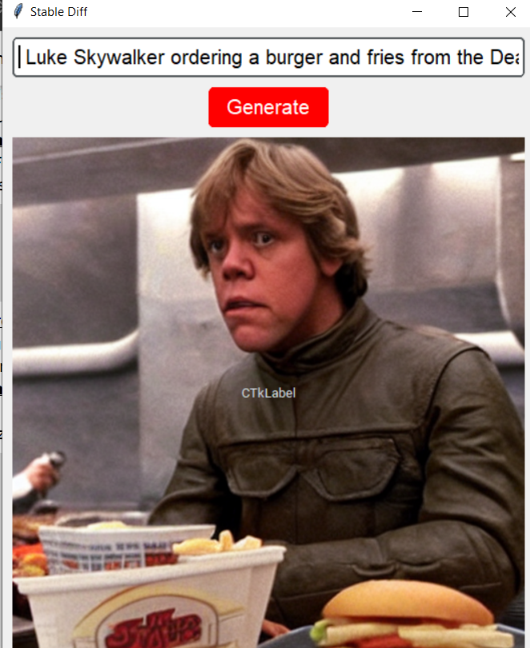
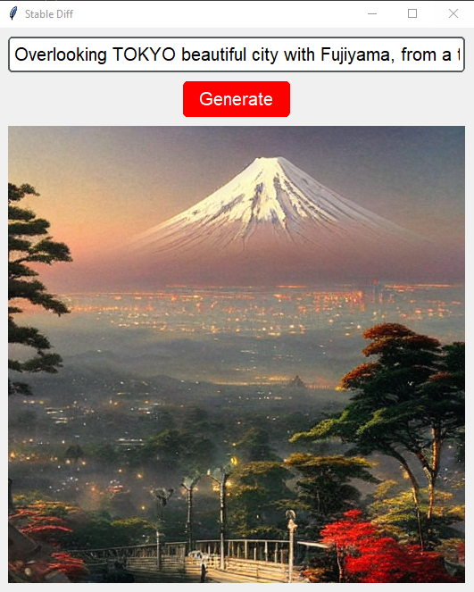
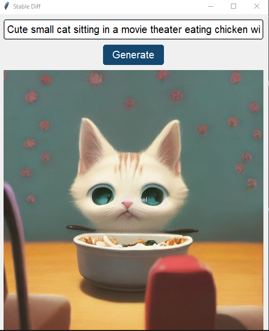

# Stable Diffusion Image Generation

This project is a simple GUI application built with Python's Tkinter library for generating images using the Stable Diffusion model. The Stable Diffusion model is a generative model for creating high-quality images based on text prompts.

## Installation

To run this project, you need to have Python installed on your system. Additionally, you'll need to install the required libraries. You can install them using pip:

```bash
pip install -r requirements.txt
```

## Usage

To run the application, simply execute the `app.py` file:

```bash
python app.py
```

Once the GUI window opens, you can input a text prompt in the provided entry field and click on the "Generate" button. This will trigger the generation of an image based on the provided prompt.

## Additional Notes

### Streamlit Version

Alternatively, you can use the Streamlit version of this application. Execute the `appstr.py` file to run the Streamlit version.

```bash
streamlit run appstr.py
```

### Saved Images

Some images generated using this application have been saved for reference. You can find them in the `generated_images` directory. These images showcase the output of the Stable Diffusion model based on various text prompts.

## Example Images

Here are a few examples of images generated using this application:


<div style="display: flex;">
    
    
    

</div>


Feel free to explore more by providing different text prompts and experimenting with the model's capabilities!
